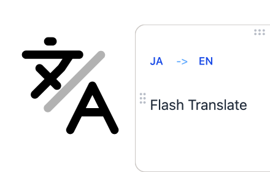

# Flash Translate



A Chrome extension for instant translation using the browser's built-in Translator API.

[](https://www.youtube.com/watch?v=KhFbv0te2Ck)

## Features

- **Instant translation on text selection**: Select text to view translations immediately
- **Handles long text**: Translate large paragraphs without length limits
- **Unlimited translations**: Translate long passages as often as you like
- **Site exclusion**: Disable translation on specific websites
- **Settings sync**: Your preferences sync automatically across devices
- **Privacy-focused**: All translation happens on-device using Chrome's built-in AI - no data sent to external servers

## Requirements

- **Chrome 138+** (Translator API support)
- **Enable Translator API**:
  1. Open `chrome://flags`
  2. Search for "Translator API"
  3. Set to "Enabled"
  4. Restart Chrome

## Installation

### Chrome Web Store

[**Install Flash Translate**](https://chromewebstore.google.com/detail/gibfhkdnpbinchfllkhaihmghbbollfd)

### Manual Installation (Development)

1. Run `bun run dev` or `bun run build`
2. Open `chrome://extensions/`
3. Enable "Developer mode"
4. Click "Load unpacked"
5. Select the `dist` folder

## Development

```bash
# Install dependencies
bun install

# Start development server (with HMR)
bun run dev

# Production build
bun run build

# Type checking
bun run lint
```

## Tech Stack

- **Vite** + **@crxjs/vite-plugin** - Chrome extension builds with HMR
- **React 19** + **TypeScript** - UI components
- **React Compiler** - Automatic memoization
- **Tailwind CSS v4** - Styling
- **Chrome Translator API** - On-device AI translation

## Project Structure

```
src/
├── manifest.ts              # Chrome extension manifest
├── background/              # Service Worker
├── content/                 # Content Script (text selection → translation popup)
│   ├── components/          # TranslationPopup, etc.
│   ├── hooks/               # useTextSelection, useTranslator, etc.
│   └── styles/
├── popup/                   # Popup UI (settings, manual translation)
│   ├── components/
│   └── styles/
└── shared/                  # Shared code
    ├── components/          # ErrorBoundary, etc.
    ├── constants/           # Language list
    ├── storage/             # chrome.storage operations
    ├── types/               # Type definitions
    └── utils/               # Translator API wrapper
```

## Privacy

Flash Translate respects your privacy. All translation is performed locally on your device using Chrome's built-in Translator API. No text or personal data is sent to external servers. See [PRIVACY.md](PRIVACY.md) for details.

## License

MIT
